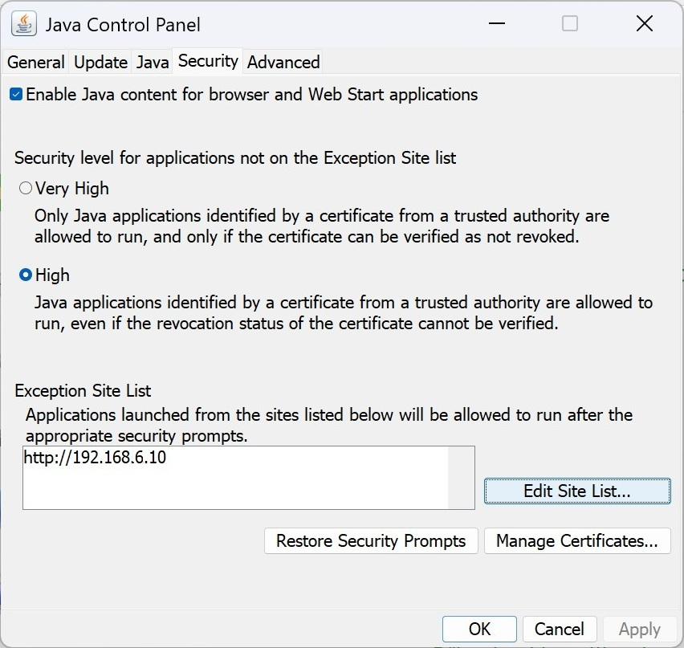
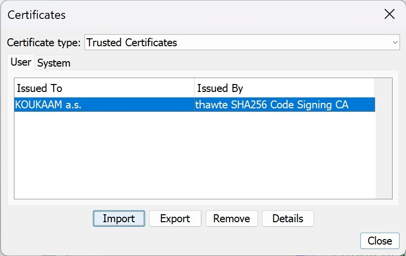
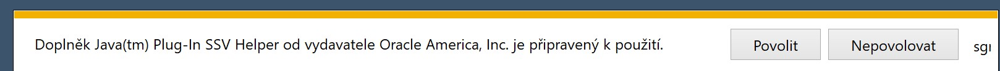

> How to use the Ipcorder NVR on Windows 11
### Krok č.1: Instalace Javy  
Je potřeba naistalovat Windows Offline (to znamená 32-bit verzi) [odtud](https://www.java.com/en/download/manual.jsp)  

### Krok č.2: Nastavení Javy  
Zadat IP adresu rekordéru do Exception Site List

  
### Krok č.3: Importovat certifikát  
Importovat [tento](koukaam.p12) do Java Control Panelu > Manage Certificates > Trusted Certificates  

### Krok č.3: Otevřít Internet Explorer  
Přes bat soubor nebo powershell kde bude toto:  
*@PowerShell -ExecutionPolicy RemoteSigned -Command New-Object -COMObject InternetExplorer.Application -Property @{Navigate2='192.168.6.10'; Visible=1}*  

Následně se prohlížeč zeptá na povolení spuštění Java doplňku, to tedy Povolit  

